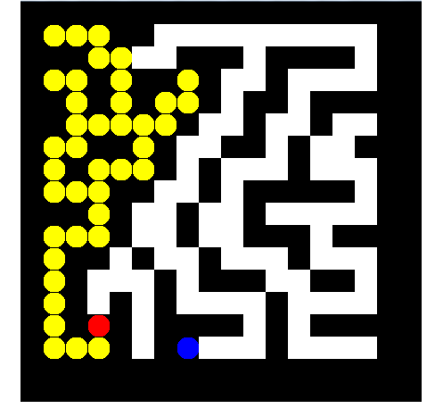

# Maze Program
The program creates a maze and then solves it by the utilization of the popular backtraking algorithm

Instructions

This repository has no branches. You can use the only branch with no restriction.
Make sure you have these installed
    - [git](http://git-scm.com/)
    
Clone this repository into your local machine using the terminal (mac) or Gitbash (PC) > git clone https://github.com/planetoftheweb/Maze.git
CD to the folder cd maze
